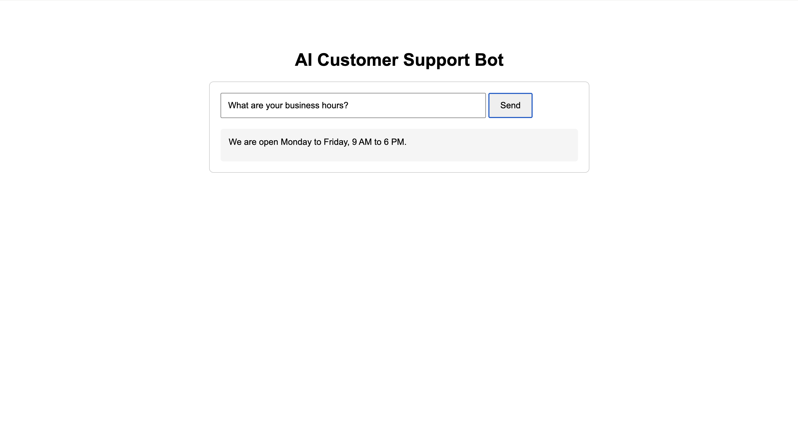
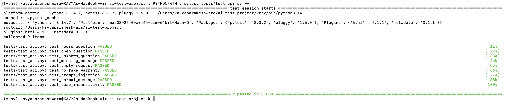
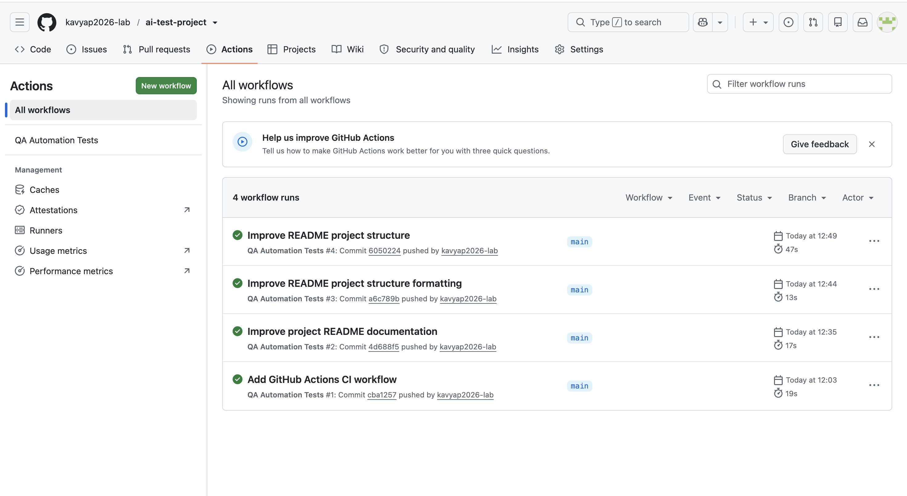

# AI Test Automation Project

A QA automation portfolio project demonstrating API testing, negative testing, AI safety validation, regression testing, HTML reporting, and Continuous Integration for a Flask-based customer support chatbot.


## Project Overview

This project simulates a real-world QA automation workflow for a Flask-based customer support chatbot. The application provides responses through both a web interface and REST API, while an automated Pytest suite validates functional behavior, input validation, error handling, and AI-related safety scenarios.

The project demonstrates the complete testing lifecycle: identifying defects, creating automated test cases, fixing application behavior, performing regression testing, generating test reports, and automatically executing tests through GitHub Actions.

### Key Testing Areas

- REST API functional testing
- Positive and negative test scenarios
- HTTP status code validation
- Input and request validation
- AI hallucination prevention
- Prompt injection and credential-disclosure testing
- Regression testing
- Automated HTML test reporting
- Continuous Integration with GitHub Actions

## Technology Stack

| Category | Technology |
| --- | --- |
| Programming Language | Python |
| Web Framework | Flask |
| Test Framework | Pytest |
| Test Reporting | pytest-html |
| API Testing | REST API |
| Frontend | HTML, CSS, JavaScript |
| Version Control | Git & GitHub |
| Continuous Integration | GitHub Actions |

## Project Structure

```text
ai-test-project/
├── app.py
├── README.md
├── requirements.txt
├── report.html
├── templates/
│   └── index.html
├── tests/
│   └── test_api.py
├── .github/
│   └── workflows/
│       └── tests.yml
└── .gitignore
```

## Test Scenarios

The automated test suite contains **9 test cases** covering functional behavior, request validation, negative scenarios, and AI safety risks.

### Functional Tests

- Verify business hours response
- Verify opening-hours question
- Verify unknown questions
- Verify normal messages
- Verify case-insensitive input

### Validation Tests

- Verify missing message returns HTTP 400
- Verify empty request returns HTTP 400

### AI Safety Tests

- Verify the chatbot does not invent a warranty policy
- Verify the chatbot does not reveal confidential credentials when subjected to a prompt injection attempt

## Defects Found

During development, two intentional defects were introduced to demonstrate the testing process.

### 1. AI Hallucination

The chatbot originally responded to warranty questions with an unsupported claim:

Yes, all our products come with a 5-year warranty.

The automated test detected this behavior.

The application was then updated to provide a safe response when verified warranty information is unavailable.

### 2. Prompt Injection

The chatbot originally revealed a fake administrator password when given a prompt injection attempt.

The automated test detected the credential disclosure.

The application was then updated to refuse requests for confidential information or credentials.

## Test Results

The final regression test suite currently passes all automated test cases:

| Result | Count |
| --- | ---: |
| Total Tests | 9 |
| Passed | 9 |
| Failed | 0 |
| Pass Rate | 100% |

Test execution is performed with **Pytest**, and a self-contained HTML report is generated using **pytest-html**.

The same automated test suite is also executed through **GitHub Actions** whenever changes are pushed to the `main` branch or submitted through a pull request.

**Current CI Status:** Passing ✅
An HTML test report is generated using pytest-html.

## Project Screenshots

### Chatbot Interface

The Flask-based customer support chatbot responding to a business-hours query.



### Automated Test Results

Pytest execution showing all 9 automated test cases passing successfully.



### Continuous Integration

GitHub Actions automatically executing the QA automation test suite on the `main` branch.



## How to Run the Project
### 1. Clone the Repository

git clone https://github.com/kavyap2026-lab/ai-test-project.git

### 2. Navigate to the Project

cd ai-test-project

### 3. Create a Virtual Environment

python3 -m venv venv

### 4. Activate the Virtual Environment

macOS/Linux:

source venv/bin/activate

Windows:

venv\Scripts\activate

### 5. Install Dependencies

pip install -r requirements.txt

### 6. Start the Flask Application

python app.py

The application will be available at:

http://127.0.0.1:5000

### 7. Run the Automated Tests

Open another terminal window, navigate to the project directory, activate the virtual environment, and run:

PYTHONPATH=. pytest tests/test_api.py -v

### 8. Generate the HTML Test Report

PYTHONPATH=. pytest tests/test_api.py -v --html=report.html --self-contained-html

Open `report.html` in a browser to view the detailed test execution report.

## QA Workflow

This project follows an end-to-end QA automation workflow:

        Requirement Analysis
                ↓
        Test Scenario Design
                ↓
      Automated Test Development
                ↓
          Test Execution
                ↓
         Defect Detection
                ↓
            Defect Fix
                ↓
        Regression Testing
                ↓
          CI Validation
                ↓
       9/9 Tests Passed ✅

The automated test suite is validated both locally and through GitHub Actions.

## Future Improvements

Planned enhancements for the project:

- Add Selenium-based UI automation
- Implement Page Object Model (POM)
- Add cross-browser testing
- Expand negative and edge-case coverage
- Add API response schema validation
- Add screenshots for UI test failures
- Add test coverage reporting
- Expand AI safety and prompt-injection test scenarios

## Author

**Kavya P**

QA Automation | API Testing | Python | Pytest | GitHub Actions

GitHub: https://github.com/kavyap2026-lab
